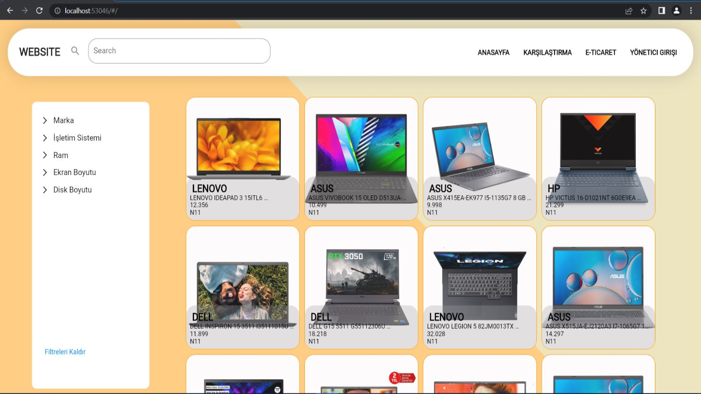

# Web Scraping 

## Çalıştırmak
> n11 spider için scrapy crawl n11 ve n11 details icin scrapy crawl n11details
-    Diğer siteler için de spider name kullanarak veri tabanına eklme yapılır.

- Veritabanı işlemleri bittikten sonra flaskWeb dosyasındaki app.py dosyası çalıştırılır .

- Daha sonra terminalden flutter run -d chrome komutu girilerek site başlatılır.

  

 [Pelin Ozdemir](https://github.com/pelinozdemir)
